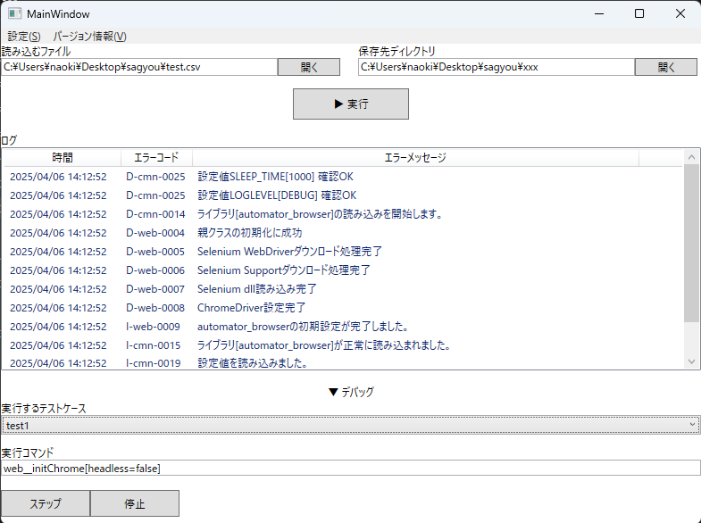

# Automator-UI

Automator-UI は自動化ツールの UI 部分です。

UI のみの実装となるため、別途 [automator-actioner（コア機能）](https://github.com/HatoriIchigo/automator-actioner)や[automator-baselib（プラグインベースライブラリ）](https://github.com/HatoriIchigo/automator-baselib) 及び自動化を行なうプラグインのインストールが必要になります。

## 概要

Automator-UI は自動化ツールを扱いやすくする GUI ツールです。

以下機能が使用できます。

- 自動化プログラムを読み込む（現時点で csv のみ）
- 自動化結果等の保存ディレクトリを指定
- ログの出力
- 各種コマンドのデバッグ



## ダウンロード方法

[ここ](https://github.com/HatoriIchigo/Automator-ui/releases)からダウンロードしてください。

なお、デフォルトでコア機能(automator-actioner)とプラグインベースライブラリ(automator-baselib)は導入されています。

## 使い方

- プログラムから読み込む場合

  プログラムは.csv で記述できます。
  1 列目にテストケース名を入力し、1 行に一つのテストケースを記入できます。
  `#`から始まる行は読み込まれません。

  例：

  ```
  test1,web__initChrome[headless=false],web__goto[url=http://www.yahoo.co.jp],web__input[tag=input&text=hello&type=search],web__scrshot,web__reset
  test2,web__initChrome,web__goto[url=http://www.yahoo.co.jp],web__input[tag=input&text=world&type=search],web__scrshot[name=test.png],web__reset
  ```

  上記の例の場合、テストケース名が`test1`及び`test2`になります。
  これらはフォルダ出力の際に使用されるほか、デバッグなどでも使用できます。

  また、`web__`からはじまるものがコマンドになります。
  例えば、`web__initChrome[headless=false]`の場合、web ライブラリ（web 自動化ツール）の initChrome（ブラウザ Chrome の初期化）を headless=false（バックグラウンドで実行しない）で実行しています。
  各プラグインの実行できる機能に関しては各種プラグインを参照してください。

- デバッグで使用する場合
  デバッグを開くとデバッグを実行できます。
  「実行するテストケース」にファイルから読み込んだプログラムのケース名 もしくは DEBUG を指定してください。
  実行コマンドに、コマンドを入力しステップボタンを入力することで実行されます。

## フォルダ構成について

以下のようなフォルダ構成になっています。

- config (Folder) : 各種プラグインの設定ファイルを配置
- lib (Folder) : コアプログラムやプラグインベースライブラリを配置
- opt (Folder) : 自動化時に必要となるプログラムや dll を配置
- tmp (Folder) : プログラムの使用する一時ディレクトリ
- Automator.exe : プログラム自動化 UI の本体

## 拡張プログラム

以下拡張プログラム(dll)を lib 配下に入れることで、各種自動化を行うことができます。

- [web 操作自動化](https://github.com/HatoriIchigo/automator-browser)
